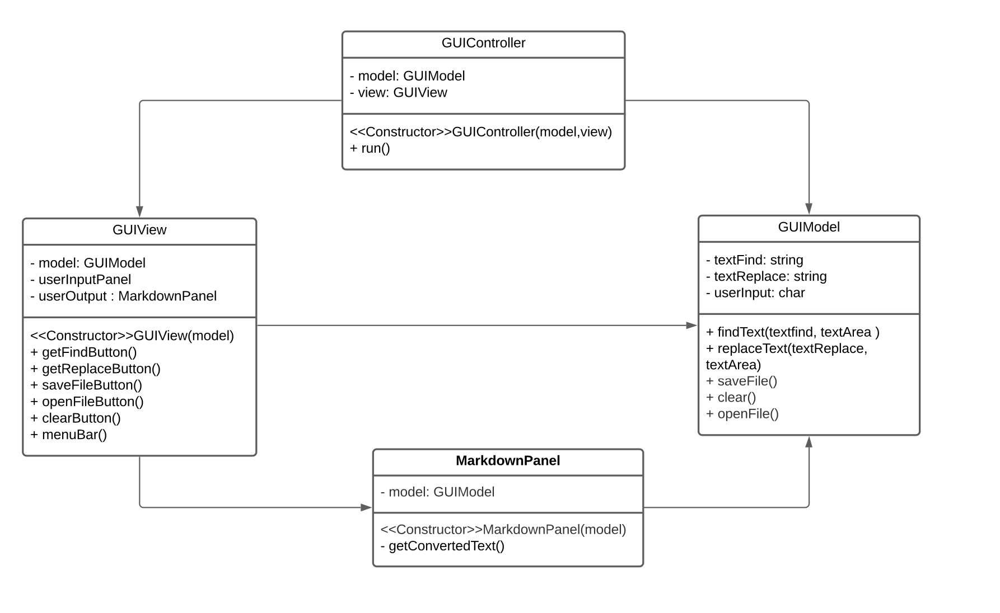
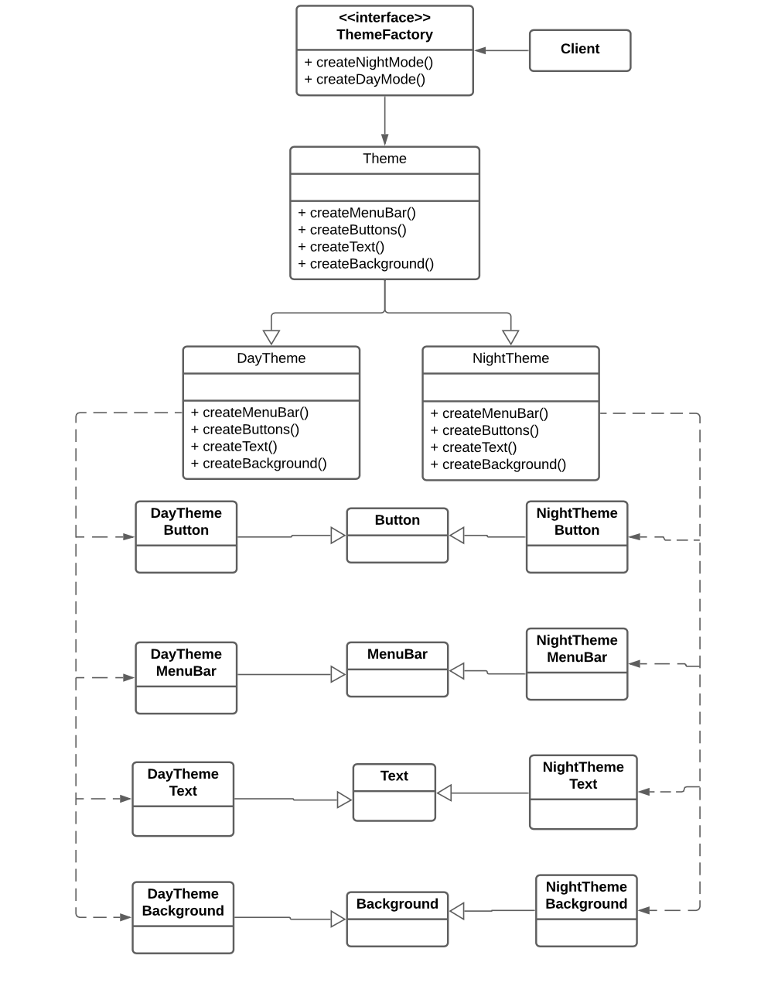
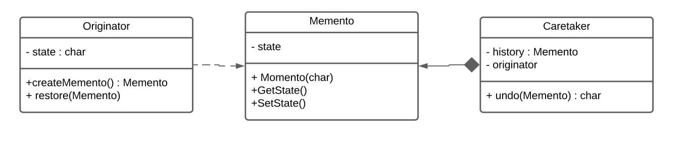

# ✍️ Jotdown 
 
  Authors: [Anchita Bora](https://github.com/anchitab), [Jeana Tijerina ](https://github.com/Jeana-T), [Dhruvi Faria](https://github.com/dhruvif)
 
## Project Description
 ## Phase I
 A minimal text editor for students, by students. 
 * Why is it important or interesting to you?
    * Text editors are a crucial part of a computer science student’s workspace. Many rely on this tool not only for coding purposes but also for taking notes, jotting ideas, and even writing assignments. We are avid users of text editors and want to create one for us to use. We want to build a Markdown text editor to allow readability but also allows stylistic elements like bold and italicize. 
 
 * What languages/tools/technologies do you plan to use? (This list may change over the course of the project)
    * [Python](https://www.cplusplus.com/) - An extension of the C programming language optimized for building high-performance applications
    * [Tkinter](https://docs.python.org/3/library/tkinter.html) - The standard Python interface to the Tk GUI toolkit
    * [Git](https://git-scm.com/) - A distributed version control system to track updates in code during development within teams
 
  * What will be the input/output of your project?
     * The input will be text that users put into the document and the output is the properly formatted text in alliance to Markdown syntax. 

  * What are the three design patterns you will be using?
    ### Pattern 1: Memento 
    #### Features: Undo, Cursor, Scroll Text, Edit History
    * Memento enables developers to work on the previous state of objects in the program. This allows features such as undo and edit history to be created as this design pattern can both save and restore the state of its objects. In our project, we plan to implement features such as the scroll position, undo button, cursors coordinates, and edit history. As Memento doesn’t alter the internal structure of the objects, a lot of these features can be created using this design pattern.
    ### Pattern 2: Composite 
    #### Features: GUI
    * Composite enables developers to organize objects into tree structures and navigate these trees as individual objects.  In our program, the user will be able to interact with our project through a GUI or Graphical User Interface. This design pattern allows us to integrate new elements without breaking the previous code. This pattern reduces technical debt as you do not need to use concrete classes or objects since complex and simple elements are all treated uniformly. 
    ### Pattern 3: Abstract Factory
    #### Features: Copy/Paste, Search/Replace, Night Mode Customization 
    * The Abstract Factory Design Pattern essentially helps create families of objects that are related to each other without needing to name their concrete classes. In our program, we hope to implement features such as the ability to customize screen preference, copy/paste function, and enable users to search and replace. This design pattern allows us to integrate new elements without breaking the previous code.

## Phase II
 
## Class Diagrams 
 
### MVC Diagram
Our Model, View, and Controller Diagram was used to showcase how we plan to design our Graphical User Interface. The GUI Model contains the essential features of our GUI including textfind, textreplace, userinput, etc. GUI View contains the code that the user directly works with, including button functions and page handling. Finally, GUI Controller is the medium between Model and View, as it digests the user input and decides which action will follow. 

### Abstract Factory Diagram 
We chose this design pattern for our night-shift mode and day-shift modes. The reasoning behind this decision is that this design pattern allows us to create families of related objects without the need to create concrete classes.  In our diagram, our family or explicit interface is “Theme”, and its variants are “DayTheme” and “NightTheme”. Then, we have declared our Abstract Factory as “ThemeFactory”, with creation methods of createMenuBar, createButtons, etc. Then we have our variants as discussed above and their respective creational methods. Below these, we have our Abstract and Concrete  Products. 

### Memento Diagram 

We chose the design pattern Memento to implement the undo feature into our project.  The Originator class creates a “state” by taking a snapshot of its current state, which additionally allows it to restore to previous states. The memento class is the value that behaves as the aforementioned snapshot of the state. Finally, the Caretaker class manages when the snapshots should be taken as when it should be restored (the undo function).

 

 > ## Final deliverable
 > All group members will give a demo to the TA during lab time. The TA will check the demo and the project GitHub repository and ask a few questions to all the team members. 
 > Before the demo, you should do the following:
 > * Complete the sections below (i.e. Screenshots, Installation/Usage, Testing)
 > * Plan one more sprint (that you will not necessarily complete before the end of the quarter). Your In-progress and In-testing columns should be empty (you are not doing more work currently) but your TODO column should have a full sprint plan in it as you have done before. This should include any known bugs (there should be some) or new features you would like to add. These should appear as issues/cards on your Kanban board. 
 ## Screenshots
 > Screenshots of the input/output after running your application
 ## Installation/Usage
 > Instructions on installing and running your application
 
 Installations:
 - Python 3
 - Tkinter
 ## Testing
 > How was your project tested/validated? If you used CI, you should have a "build passing" badge in this README.
 
