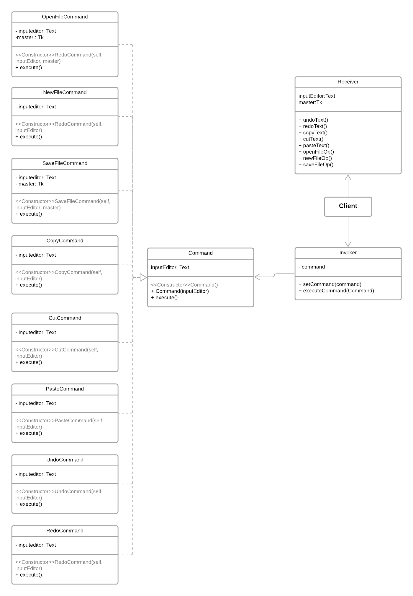

# ✍️ Jotdown 
 
  Authors: [Anchita Bora](https://github.com/anchitab), [Jeana Tijerina ](https://github.com/Jeana-T), [Dhruvi Faria](https://github.com/dhruvif)
 
## Project Description
 ## Phase I
 A minimal text editor for students, by students. 
 * Why is it important or interesting to you?
    * Text editors are a crucial part of a computer science student’s workspace. Many rely on this tool not only for coding purposes but also for taking notes, jotting ideas, and even writing assignments. We are avid users of text editors and want to create one for us to use. We want to build a Markdown text editor to allow readability but also allows stylistic elements like bold and italicize. 
 
 * What languages/tools/technologies do you plan to use? (This list may change over the course of the project)
    * [Python](https://www.cplusplus.com/) - An extension of the C programming language optimized for building high-performance applications
    * [Tkinter](https://docs.python.org/3/library/tkinter.html) - The standard Python interface to the Tk GUI toolkit
    * [Git](https://git-scm.com/) - A distributed version control system to track updates in code during development within teams
 
  * What will be the input/output of your project?
     * The input will be text that users put into the document and the output is the properly formatted text in alliance to Markdown syntax. 

  * What are the three design patterns you will be using?
    ### Pattern 1: MVC
    #### Features: GUI
    * The Model-View-Controller design pattern enables developers to work on creating an user interface by splitting the logic into the three interconnected classes. This allows the separation of our implementation to selectively choose where the user can input and view information and how the program processes it. In our project, we plan to use this class to implement the GUI (Graphical User Interface) and implement its different aspects in their respective classes.
    ### Pattern 2: Factory Method
    #### Features: Night Mode/Day Mode Customization 
    * The Factory Method design pattern essentially helps create an interface as a superclass and its respective subclasses which have the ability to change the type of the subclasses. In our program, we used this design pattern to implement a feature that gives the user the ability to switch between night mode and day mode. By creating different products for night mode and day mode, factory method can help us distinguish how the same type of objects are implemented differently in their individual classes.
    ### Pattern 3: Command
    #### Features: MenuBar(Copy, Cut, Paste, Undo, Redo, Save, Open, New File)
    * The Command design pattern allows developers to parameterize the different features we intend for it to execute. Using Command gives us the ability to call the same execute method with different sender requests and organize the function executions. We have implemented commands such as Copy, Undo, Save File and many more to enable users to use the GUI efficiently and save their work for later access.


## Phase II
 
## Class Diagrams 
 
### MVC Diagram
Our Model, View, and Controller Diagram was used to showcase how we plan to design our Graphical User Interface. The GUI Model contains the essential features of our GUI including textfind, textreplace, userinput, etc. GUI View contains the code that the user directly works with, including button functions and page handling. Finally, GUI Controller is the medium between Model and View, as it digests the user input and decides which action will follow. 


### Factory Method Diagram 
We chose this design pattern for our night-shift mode and day-shift modes. The reasoning behind this decision is that this design pattern allows us to create families of related objects without the need to create concrete classes.  In our diagram, our family or explicit interface is “Theme”, and its variants are “DayTheme” and “NightTheme”. Then, we have declared our Abstract Factory as “ThemeFactory” and have our variants as discussed above and their respective creational methods.


### Command Diagram 

We chose the design pattern Command to implement the menubar feature into our project.  The overarching Command class implements several Concrete Commands such as Cut, Copy, Paste, Undo and Redo under the Edit Menu. The user can also access features such as Save File, New File, and Open File under the File category on the Menu Bar. The Invoker is the one that sets the commands to be called and executes them in our MVC file, while the Receiver class is optional to carry out the logic behind the concrete commands.


 

 > ## Final deliverable
 > All group members will give a demo to the TA during lab time. The TA will check the demo and the project GitHub repository and ask a few questions to all the team members. 
 > Before the demo, you should do the following:
 > * Complete the sections below (i.e. Screenshots, Installation/Usage, Testing)
 > * Plan one more sprint (that you will not necessarily complete before the end of the quarter). Your In-progress and In-testing columns should be empty (you are not doing more work currently) but your TODO column should have a full sprint plan in it as you have done before. This should include any known bugs (there should be some) or new features you would like to add. These should appear as issues/cards on your Kanban board. 
 ## Screenshots
 > Screenshots of the input/output after running your application
 
 
 
 
 ## Installation/Usage
 > Instructions on installing and running your application
 
 Installations:
 - Python 3
 - Tkinter
 - Updated pip3
 
 Run the application:
 ```
 python3 MVC.py
 ```
 ## Testing
 > How was your project tested/validated?
 
 To test our project, we used [Python's unittest](https://docs.python.org/3/library/unittest.html). Using assert methods to compare our expected and tested values, we were able to validate that our program executed its functions accurately. Python's test cases instances allowed us to run the tests, records failures, and check if all of the conditions are being met. 
 
 To run our tests, you'd simply type this into the command line:
 ```
 python3 -m unittest
 ```
